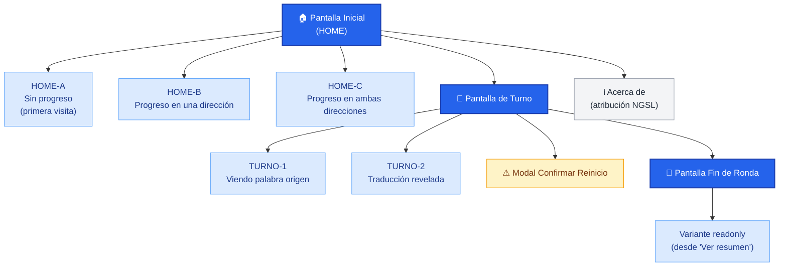

# arbol-contenidos.md — vocab-1000 · Etapa 2 + consolidación retroactiva

> Output del agente UX. Jerarquía de pantallas y secciones navegables del producto MVP. Construido desde los casos de uso de etapa 1 (CU-01..CU-07) y las decisiones funcionales del kickoff. No requiere historias de usuario.
>
> Forma textual normativa: Mermaid (ARQ-025 — Markdown canónico, render PNG aditivo).
>
> **Historial de versiones**:
> - **v1** (2026-05-21) = árbol aprobado en gate humano del kickoff.
> - **v2** (2026-05-26) = consolidacion-ux ejecutada en Etapa 6 retroactiva. Delta: §5 reescrita (el producto sí usa rutas reales de Next.js App Router, no SPA de estado interno) + §6 nueva (rutas auxiliares del repo no consumidas por usuario final). Inputs leídos: `funcional.md v4`, `tecnica.md v3` (en consolidación paralela), código real desplegado en `https://vocab-1000.vercel.app/`.

---

## 1. Diagrama del árbol de contenidos



**Leyenda**:
- Nodos azul oscuro: **pantallas primarias** (Home, Turno, Fin de Ronda).
- Nodos azul claro: **variantes de estado** de una pantalla primaria.
- Nodo gris: **secundaria** (Acerca de).
- Nodo amarillo: **modal de confirmación** (no es una pantalla, es overlay).

---

## 2. Jerarquía textual

```
Pantalla Inicial (HOME)
├── HOME-A · sin progreso
├── HOME-B · progreso en una dirección
├── HOME-C · progreso en ambas direcciones
└── Acerca de · atribución NGSL

Pantalla de Turno
├── TURNO-1 · viendo palabra origen
└── TURNO-2 · traducción revelada
    └── (overlay) Modal Confirmar Reinicio

Pantalla Fin de Ronda
└── (variante) Fin de Ronda en modo readonly
```

---

## 3. Densidad de contenido por pantalla (estructura interna)

### 3.1. HOME (variante depende del progreso)

- **Header**: título del producto + acceso a "Acerca de" (icono `ⓘ`).
- **Cuerpo**:
  - HOME-A: tagline + selector de dirección (dos botones, uno por dirección).
  - HOME-B: una card de la dirección con progreso + una card de la dirección "Aún no has empezado".
  - HOME-C: dos cards apiladas, una por dirección con su progreso.
- **Footer**: atribución NGSL persistente.

### 3.2. Pantalla de Turno

- **Header**: dirección activa + indicador de progreso doble señal + mini-progreso de la otra dirección + control de inversión (SVG inline).
- **Cuerpo**:
  - TURNO-1: palabra origen grande centrada + botón "Mostrar traducción".
  - TURNO-2: palabra origen + traducción + tipo gramatical localizado + dos botones (Acerté / Fallé).

### 3.3. Pantalla Fin de Ronda

- **Cuerpo**:
  - Texto de felicitación.
  - 4 datos: dirección completada, palabras acertadas, turnos totales, % aciertos.
  - 2 acciones: "Volver a empezar" / "Cambiar dirección".
  - Variante readonly: solo cierra, sin acciones primarias.

### 3.4. Acerca de

- **Cuerpo**: atribución completa NGSL, licencia CC BY-SA 4.0, enlace al sitio oficial, créditos del producto.

---

## 4. Estados especiales (overlays / banners)

| Estado | Pantalla(s) afectada(s) | Visualización |
|---|---|---|
| Memory-only (sin persistencia disponible) | Todas | Banner amarillo fijo arriba del header, no-dismissable |
| Cargando catálogo | Bootstrap (antes de Home) | Pantalla con spinner mínimo |
| Catálogo no carga | Bootstrap | Mensaje full-screen + botón "Reintentar" |
| Modal de confirmación de reinicio | TURNO (estados 1 y 2) | Overlay sobre la pantalla actual |

---

## 5. Notas

- **Sin menú lateral, sin menú hamburguesa, sin sidebar**. La navegación es lineal y se infiere del contexto. Esto encaja con la simplicidad del producto (HU-01: usable sin instrucciones).
- **Rutas Next.js App Router** (consolidado v2 — antes en v1 se declaraba SPA de estado interno; el producto construido sí usa rutas reales): `/` (HOME), `/jugar/[direction]/` (TURNO-1/2 + Fin de ronda) con `direction ∈ {en-es, es-en}`, `/acerca-de`. Las variantes HOME-A/B/C son del mismo árbol `/`, decididas por el estado del store al hidratar. El cambio de dirección mid-game navega a `/jugar/<la otra>/`, lo cual sirvió para resolver HU-006 (ver `memory.md` del piloto, fix de Fase 4).
- **Modo oscuro**: diferido a fase 2 (decisión kickoff). Los design tokens están preparados para activarlo con `prefers-color-scheme: dark` o toggle explícito.

---

## 6. Rutas auxiliares del repo (no consumidas por usuario final)

Rutas presentes en el código pero **fuera del flujo del usuario final del juego**. Se consolidan aquí para que cualquier consumidor futuro del árbol de contenidos no las confunda con pantallas del producto:

- **`/styleguide`** — guía de estilos del sistema de diseño, núcleo del entregable del sub-gate 4.2 (decisión sistémica 2026-05-22). Cataloga paleta, tipografía, componentes con todos sus estados. Heredable entre proyectos del arnés. **No es destino del jugador**; es material de equipo / stakeholder.

Estas rutas no aparecen en el diagrama §1 ni en la jerarquía §2 porque el árbol de contenidos describe el producto desde la perspectiva del **usuario final**.

---

## 7. Delta v2 (Etapa 6 retroactiva — consolidacion-ux 2026-05-26)

Aplicación de la habilidad `consolidacion-ux` sobre el piloto cerrado el 2026-05-23 (Excepción retroactiva post-cierre):

- **ARB-INC-01** (tipo A — contradicción) — resuelta en §5: v1 declaraba "Single Page Application: no hay routing entre pantallas separadas en términos de URL en MVP". Realidad: el producto sí usa rutas reales Next.js App Router (`/`, `/jugar/[direction]/`, `/acerca-de`). El cambio de dirección mid-game incluso depende de la navegación URL para resolver HU-006 (fix de Fase 4).
- **ARB-INC-02** (tipo C — feature no declarada) — resuelta en §6 nueva: la ruta `/styleguide` existe en el repo desde el sub-gate 4.2 v3. Es material de equipo (no destino del jugador) — declarada en sección §6 separada para no contaminar el árbol de pantallas del producto.

Las pantallas del producto (HOME-A/B/C, TURNO-1/2, Fin, Acerca de, Modal Reset, MemoryOnlyBanner) coinciden con el código sin deltas.
