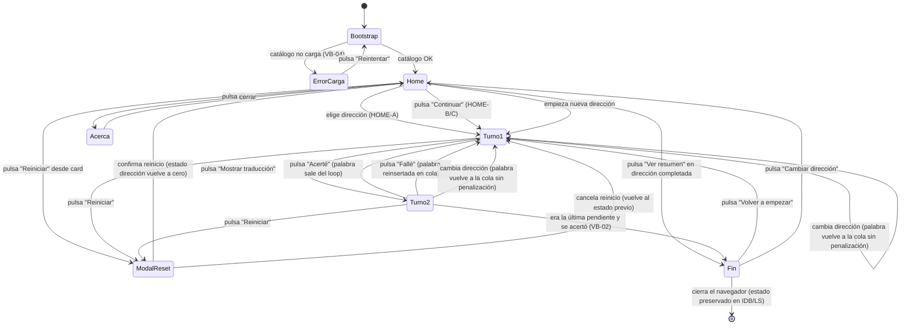
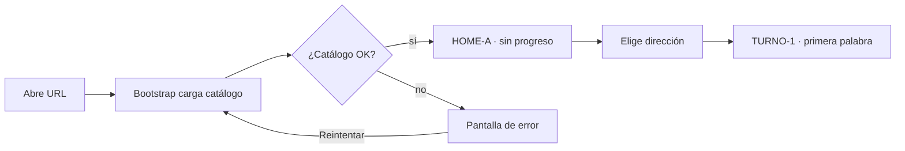
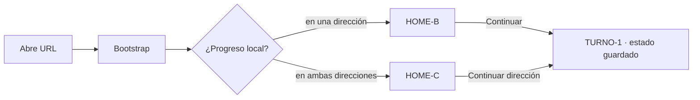
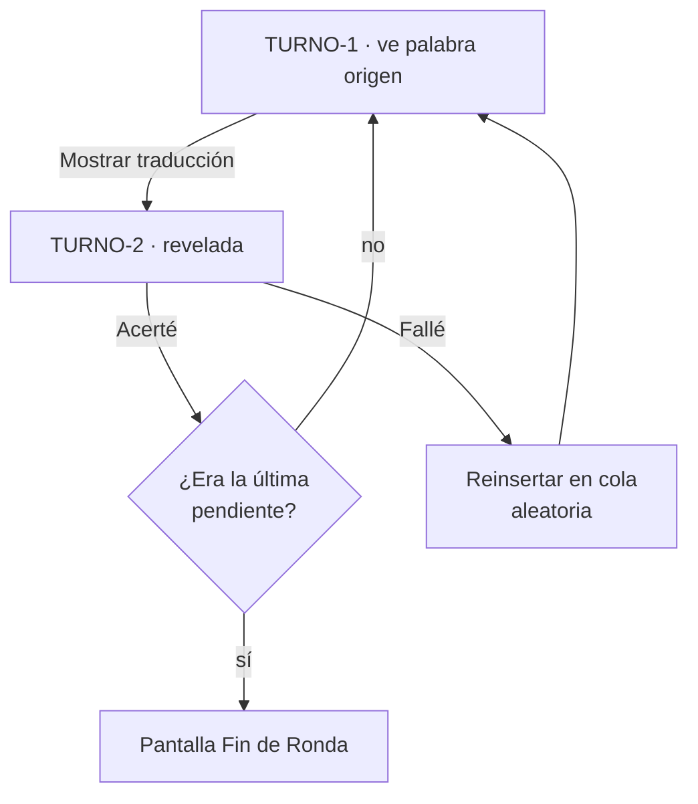
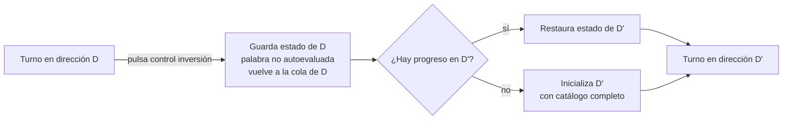
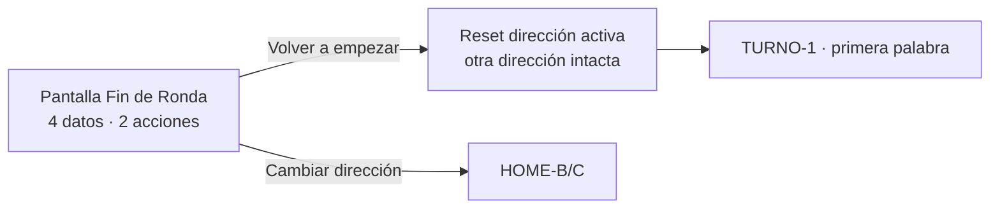
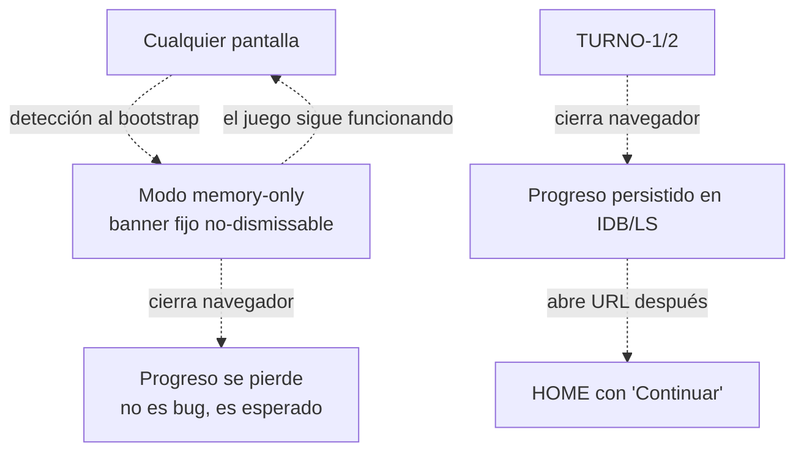

# diagrama-flujos.md — vocab-1000 · Etapa 2

> Output del agente UX. **User flow** del producto MVP a alto nivel. Construido desde los casos de uso de etapa 1 (CU-01..CU-07) y las decisiones funcionales del kickoff. No requiere historias de usuario.
>
> **Verificación retroactiva 2026-05-26** (consolidacion-ux): el golden path y todas las ramificaciones del diagrama §1 + flujos §2.1-§2.5 + estados auxiliares §3 coinciden con el producto desplegado en `https://vocab-1000.vercel.app/`. **No hay deltas — versión sigue siendo v1**. El cambio de dirección mid-game (§2.4) se materializó en código con navegación URL en lugar de mutación de estado interno (fix HU-006 de Fase 4), pero el flujo conceptual es el mismo. Firma en `memory.md` del piloto.
>
> Granularidad: golden path + ramificaciones principales. Las ramas de excepción exhaustivas se cubrirán en etapa 3 (refinamiento) con las HU formales del PO.
>
> Forma textual normativa: Mermaid (ARQ-025 — Markdown canónico, render PNG aditivo).

---

## 1. Diagrama de estados (state diagram)

---

## 2. Flujos principales explicados

### 2.1. Flujo "primera visita" (CU-01)

### 2.2. Flujo "visita recurrente" (CU-02)

### 2.3. Flujo del turno (CU-03 + CU-04)

### 2.4. Flujo "cambio de dirección mid-game" (CU-05)

### 2.5. Flujo "fin de ronda y opciones" (CU-06 + CU-07)

---

## 3. Estados auxiliares (no parte del golden path)

---

## 4. Reglas de transición no representadas en los diagramas

Algunas reglas son demasiado finas para los diagramas pero forman parte del flujo:

- **Reinserción aleatoria de falladas**: cuando una palabra se marca "Fallé", se inserta en una posición aleatoria entre las pendientes restantes (no inmediatamente la siguiente, no la última). Si la cola pendiente tiene tamaño 1 tras el "Fallé", la siguiente palabra mostrada es la misma — aceptable (VB-07).
- **Tipo gramatical localizado al destino**: en TURNO-2, el tipo gramatical se muestra en el idioma destino de la dirección activa (es: "verbo" si se juega `en→es`; en: "verb" si se juega `es→en`). El TURNO-2 del wireframe lo refleja.
- **Animaciones suspendibles**: si el navegador del jugador respeta `prefers-reduced-motion: reduce`, todas las transiciones de cross-fade, fade-in, flash de color son **instantáneas** (sin animación).
- **Foco accesible**: tras cualquier transición de estado, el foco se mueve al primer interactivo de la nueva pantalla. En TURNO-2 el foco va automáticamente al botón "Acerté" para permitir autoevaluación con teclado.

---

## 5. Lo que NO entra en este diagrama (entra en etapa 3)

- Estados de error específicos por bug (network failures, race conditions entre `set` IDB y cambio de dirección, etc.).
- Manejo detallado de `aria-live` y orden de tabulación caso a caso.
- Validaciones internas de integridad del catálogo en runtime.
- Métricas de jugabilidad (intencionalmente fuera del MVP — telemetría diferida a fase 2).

Esos detalles entran en etapa 3 (refinamiento) cuando el PO redacte las HU formales y el equipo ejecutor (Backend/Frontend/SRE/QA) las analice.
